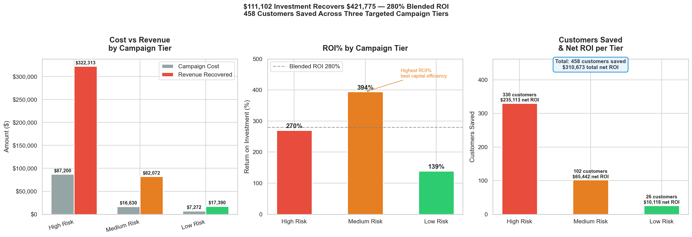

# Customer Churn Analysis
**Predicting and preventing customer churn for a telecommunications company**


---

## The Business Problem

A telecommunications company is losing **26.5% of customers annually**
— above the 25% industry benchmark. Each churned customer represents
**$1,332 in lost annual revenue**. Total revenue at risk: **$1.67M**.

This project identifies who is churning, why, and prescribes a targeted
retention strategy with a projected **279% ROI**.

---

## Key Findings

| Finding | Detail | Business Impact |
|---|---|---|
| Contract type #1 driver | Month-to-month churns at 42.7% — 15x two-year rate | Convert to annual contracts |
| First year is critical | 47% churn in year 1 vs 9% after year 4 | Redesign onboarding |
| Fiber optic highest risk | 41% churn despite paying $91/month average | Investigate satisfaction |
| Payment method signals risk | Electronic check churns at 3x autopay rate | Incentivise autopay |
| Add-ons reduce churn | Security and support customers are significantly more loyal | Bundle in welcome package |
| Senior citizens at risk | 41.7% churn — independent of other factors | Dedicated support programme |
| High risk profile exists | Month-to-month + fiber optic + electronic check = 60.4% churn | Priority outreach |

---

## The Retention Model

A logistic regression model scores all 7,043 customers by churn risk:

| Metric | Value |
|---|---|
| AUC | 0.845 |
| Recall | 77% |
| Precision | 53% |
| F1 Score | 0.63 |

Three models compared — logistic regression selected for highest AUC
and recall, and superior interpretability over Random Forest and XGBoost.

---

## Campaign ROI



| Tier | Customers | Cost | Revenue Recovered | ROI% |
|---|---|---|---|---|
| High Risk | 1,744 | $87,200 | $322,020 | 269% |
| Medium Risk | 1,663 | $16,630 | $82,233 | 394% |
| Low Risk | 3,636 | $7,272 | $17,323 | 138% |
| **Total** | **7,043** | **$111,102** | **$421,576** | **279%** |

---

## Project Structure
```
customer-churn-analysis/
│
├── notebooks/
│   ├── 01_data_cleaning.ipynb          ← cleaning and verification
│   ├── 02_exploratory_analysis.ipynb   ← correlation heatmap and ranking
│   ├── 03_feature_engineering.ipynb    ← encoding, scaling, train/test split
│   └── 04_model_training.ipynb         ← models, scorecard, campaign ROI
│
├── sql/
│   ├── 00_data_profiling.sql           ← data quality audit
│   └── 01_exploration.sql              ← 10 business queries
│
├── outputs/
│   ├── figures/                        ← 12 charts
│   ├── churn_risk_scorecard.csv        ← 7,043 customers scored
│   └── campaign_architecture.csv      ← tier-level campaign plan
│
├── reports/
│   ├── executive_brief.md              ← one-page business summary
│   └── technical_report.md            ← full analysis documentation
│
├── data/
│   └── processed/                      ← train/test splits (gitignored)
│
├── SETUP.md                            ← environment setup guide
├── PYTHON_LIBRARIES.md                 ← library reference
├── PYTHON_VISUALISATION_GUIDE.md       ← chart building reference
├── ML_PIPELINE_GUIDE.md                ← end-to-end ML reference
├── SQL_EXPLORATION_FRAMEWORK.sql       ← reusable SQL patterns
└── requirements.txt                    ← Python dependencies
```

---

## Analytical Approach

This project follows a four-layer analytical framework:

**Layer 1 — SQL Exploration**
10 business queries uncovering churn drivers, confounding variables,
and high-risk customer profiles. Key discoveries include Simpson's
Paradox in services data and a compounding risk profile churning at 60.4%.

**Layer 2 — Python Visualisation**
12 production-quality charts translating SQL findings into
executive-ready visuals. Built with matplotlib and seaborn
following a consistent design language.

**Layer 3 — Correlation Analysis**
All 18 features ranked by correlation with churn. Contract type
(r=-0.397) and tenure (r=-0.352) confirmed as strongest predictors.
Gender (r=-0.009) and phone service (r=+0.012) excluded as
non-predictive.

**Layer 4 — Machine Learning**
Three models trained and compared:

| Model | AUC | Recall | F1 |
|---|---|---|---|
| Logistic Regression | 0.845 | 0.77 | 0.63 |
| Random Forest | 0.838 | 0.72 | 0.62 |
| XGBoost | 0.832 | 0.72 | 0.61 |

Logistic regression selected — highest AUC and recall with
superior interpretability. Counterintuitively, thorough feature
engineering upstream reduced the advantage of more complex models.

---

## Technical Decisions

**Multicollinearity fix:**
tenure and totalcharges were highly correlated (r=0.829).
Engineered `avg_monthly_spend = totalcharges / tenure` to capture
pure spend signal independently of tenure. Correlation reduced
to 0.222 with negligible impact on AUC (-0.002) but significantly
improved feature interpretability.

**Feature selection:**
gender (r=-0.009) and phoneservice (r=+0.012) dropped based on
near-zero correlation with churn — reduces noise without
impacting model performance.

**Threshold selection:**
Risk tier thresholds (0.40 and 0.70) validated against probability
distribution — confirmed natural gaps at both cut points rather
than arbitrary business decisions.

**Class imbalance:**
73.5% retained vs 26.5% churned handled via
`class_weight='balanced'` in logistic regression and
`scale_pos_weight` in XGBoost.

---

## How to Run

### Prerequisites
- Python 3.14+
- PostgreSQL 17
- VS Code with Jupyter extension

### Setup
```bash
# Clone repository
git clone https://github.com/skyvisory/customer-churn-analysis.git
cd customer-churn-analysis

# Install dependencies
python -m pip install -r requirements.txt

# Configure environment variables
cp .env.example .env
# Edit .env with your PostgreSQL credentials

# Load database
psql -U postgres -d churn_analysis -f sql/00_data_profiling.sql
```

### Run notebooks in order
```
01_data_cleaning.ipynb
02_exploratory_analysis.ipynb
03_feature_engineering.ipynb
04_model_training.ipynb
```

---

## Outputs

| File | Description |
|---|---|
| `outputs/churn_risk_scorecard.csv` | All 7,043 customers scored with risk tier and intervention |
| `outputs/campaign_architecture.csv` | Tier-level campaign plan with ROI projections |
| `outputs/figures/` | 12 production-quality charts |
| `reports/executive_brief.md` | One-page business summary |
| `reports/technical_report.md` | Full analysis documentation |

---

## Known Improvements

- Migrate to sklearn Pipeline — bundle scaler and model
  into single deployable object
- GridSearchCV hyperparameter tuning on XGBoost
- SHAP values for individual prediction explanations
- Cross-validation for more robust model evaluation
- NPS/CSAT data integration for satisfaction-driven features
- Automated monthly rescoring pipeline

---

## Reference Guides

Built during this project — reusable across all future projects:

| Guide | Contents |
|---|---|
| `SETUP.md` | Environment setup from scratch |
| `PYTHON_LIBRARIES.md` | Library installation and import patterns |
| `PYTHON_VISUALISATION_GUIDE.md` | Chart templates and best practices |
| `ML_PIPELINE_GUIDE.md` | End-to-end ML pipeline reference |
| `SQL_EXPLORATION_FRAMEWORK.sql` | Reusable SQL analysis patterns |

---

## Dataset

- **Source:** IBM Telco Customer Churn dataset
- **Records:** 7,043 customers
- **Features:** 21 columns including demographics, services, and billing
- **Target:** Churn (Yes/No)

---

*Built as Project 1 of a 5-project data analytics portfolio.*
*Next project: [coming soon]*
```
